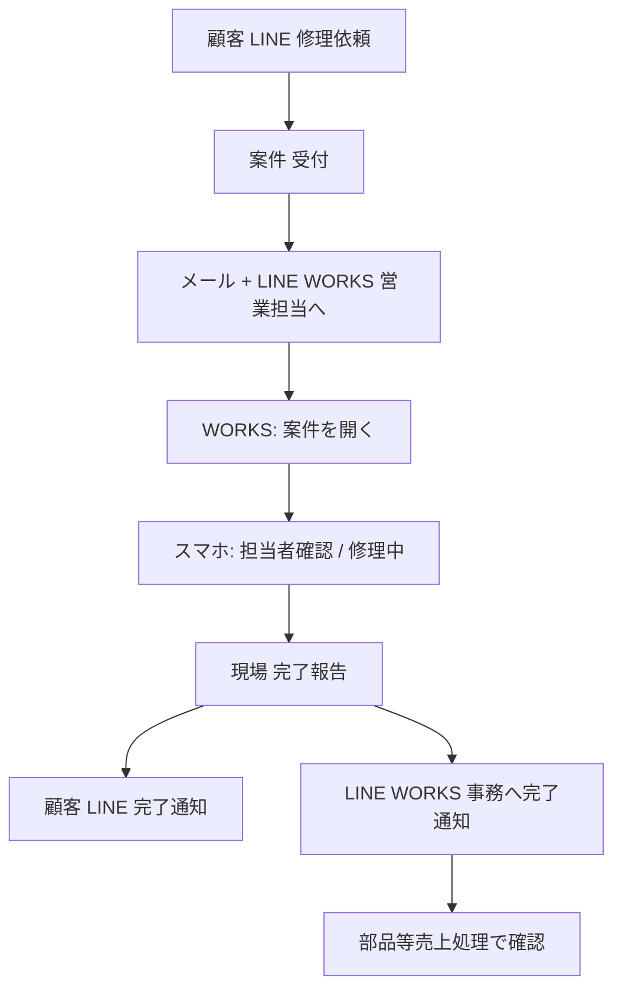

# LINE WORKS 運用方法（修理通知）

**対象:** 営業担当・事務担当・システム管理者  
**関連システム:** 三州見積書作成システム（本番: `https://estimate-system-ten.vercel.app`）  
**ダウンロード:** メインメニュー → [取扱説明書](/manual) → **LINE WORKS 運用方法**

画面操作の概要は別冊「三州見積書作成システム 取扱説明書」第8章も参照してください。

---

## 目次

1. [概要](#1-概要)
2. [通知の種類](#2-通知の種類)
3. [全体フロー](#3-全体フロー)
4. [初回セットアップ](#4-初回セットアップ)
5. [担当者の LINE WORKS 登録](#5-担当者の-line-works-登録)
6. [日常運用（営業・現場担当）](#6-日常運用営業現場担当)
7. [日常運用（事務担当）](#7-日常運用事務担当)
8. [修理案件管理での確認](#8-修理案件管理での確認)
9. [トラブルシューティング](#9-トラブルシューティング)
10. [改訂履歴](#10-改訂履歴)

---

## 1. 概要

### 1.1 目的

修理依頼の受付・進捗・完了報告について、**管轄営業所の担当者**および**事務処理担当**へ **LINE WORKS Bot** で通知し、確認状況をシステムに記録します。

### 1.2 通知経路の整理（誤解しやすい点）

| 経路 | 用途 | 備考 |
|------|------|------|
| **LINE WORKS** | 営業所担当・事務担当への修理通知 | 本書の対象 |
| **LINE 公式（LIFF）** | **顧客**への受付・進捗・完了通知 | 引き続き利用（WORKS とは別） |
| **メール（Resend）** | 担当者へのメール通知 | **LINE WORKS と並行**して送信 |

担当者向けは **LINE WORKS と LINE 公式のいずれか一方のみ**（併用しません）。  
環境変数 `REPAIR_STAFF_NOTIFY_CHANNEL=lineworks` または `line` で明示できます。未指定時は LINE WORKS の必須設定が揃っていれば LINE WORKS モードになります。

### 1.3 システム上の記録

| テーブル | 内容 |
|----------|------|
| `lineworks_staff_mappings` | 担当者名 ⇔ LINE WORKS ユーザーID（メール等） |
| `repair_lineworks_notifications` | 案件ごとの送信・確認状態（`pending` / `acknowledged` / `failed`） |
| `repair_notify_logs` | 送信ログ（channel=`lineworks`） |

---

## 2. 通知の種類

| タイミング | 宛先 | WORKS 上の操作 | システム側の結果 |
|------------|------|----------------|------------------|
| **新規受付** | 管轄営業所の担当者 | 「**案件を開く**」→ スマホ画面で進捗操作 | 通知レコード `pending` |
| **担当者確認** | （同上） | スマホで「担当者確認」／トークに「確認しました」等 | `acknowledged`、案件 `staff_confirmed` |
| **修理中** | （同上） | スマホで「修理中」／トークに「修理中」等 | 案件 `repairing`、顧客 LINE 通知 |
| **完了報告** | 営業担当 | 「案件を開く」 | 参照用 |
| **完了報告** | **事務担当** | 「**確認・売上処理**」→ Web で赤「確認」 | 売上処理画面へ遷移 |

**重要:** 新規受付の WORKS メッセージに付くボタンは **「案件を開く」1つ** です。  
「担当者確認」「修理中」は **リンク先の修理対応画面**（`/repair-mobile/{案件ID}`）のボタンで行います。

---

## 3. 全体フロー

---

## 4. 初回セットアップ

### 4.1 Supabase（SQL Editor）

**順不同厳禁のものあり。** エラーが出たら表示メッセージの SQL を実行してください。

| 順 | SQL ファイル | 内容 |
|----|--------------|------|
| 1 | `create_lineworks_integration.sql` | `lineworks_staff_mappings`、`repair_lineworks_notifications`、通知ログ拡張 |
| 2 | `add_repair_office_staff_notify.sql` | 事務担当フラグ・担当事業所（`staff_office_notify_branches`） |
| 3 | `add_repair_office_sales_confirmed.sql` | 事務の売上確認日時 |
| 4 | `add_repair_status_staff_confirmed.sql` または `apply_repair_prerequisites.sql` | ステータス `staff_confirmed` 等 |
| 5 | `enable_lineworks_staff_mappings_rls.sql` | service role 未設定時の RLS 用（必要な場合） |

### 4.2 LINE WORKS Developer Console

1. **認証アプリ**を作成し、Client ID / Client Secret / Service Account / Private Key を取得
2. **Bot** を作成し、Bot ID / Bot Secret を取得
3. Bot の **Callback URL** を設定:  
   `https://estimate-system-ten.vercel.app/api/line-works/callback`
4. **Left Callback（postback）** を有効化
5. 担当者全員が Bot と **1:1 トーク**を開始できるようにする

### 4.3 Vercel 環境変数（本番）

| 変数名 | 説明 |
|--------|------|
| `LINEWORKS_CLIENT_ID` | 認証アプリ Client ID |
| `LINEWORKS_CLIENT_SECRET` | Client Secret |
| `LINEWORKS_SERVICE_ACCOUNT` | 例: `xxxx.serviceaccount@yourdomain` |
| `LINEWORKS_PRIVATE_KEY` | PEM 全文（`\n` エスケープ可） |
| `LINEWORKS_BOT_ID` | Bot ID |
| `LINEWORKS_BOT_SECRET` | Bot Secret（callback 署名検証） |
| `LINEWORKS_SCOPE` | 通常 `bot`（省略可） |
| `PROD_BASE_URL` | `https://estimate-system-ten.vercel.app` |
| `SUPABASE_SERVICE_ROLE_KEY` | **必須級**（登録・通知・callback の DB 更新） |
| `REPAIR_STAFF_NOTIFY_CHANNEL` | `lineworks`（推奨）または `line` |
| `RESEND_API_KEY` / `MAIL_FROM` | メール通知用（従来どおり） |

ローカル開発時は任意で `LOCAL_BASE_URL=http://localhost:3000` を設定します。

### 4.4 担当者マスタ（事務向け）

**担当者マスタ**（`/staffs`）で次を設定します。

1. 対象者を選択
2. **修理完了・事務処理** を ON
3. **担当事業所** を複数選択（「その他」は全社1名のみ）
4. 保存

営業担当の管轄は、案件の **管轄営業所** と担当者マスタの **branch_id** 等で通知先が決まります。

---

## 5. 担当者の LINE WORKS 登録

### 5.1 推奨: 管理画面から登録

メニュー → **修理通知 LINE WORKS 連携**（`/lineworks-staff-notify`）

1. 画面上部の診断で **APIトークン OK**・**Supabase service role 設定済み** を確認
2. **登録する担当者** を **プルダウンから選択**（`staff_id` で登録。**手入力の氏名は表記ゆれでエラーになりやすい**）
3. 次のいずれか:
   - **QR コード**を担当者のスマホで読み取り、自己登録画面でログイン ID を送信
   - **詳細**を開き、LINE WORKS ID（メール）を **手動登録**
4. 必要なら **テスト送信**で届くか確認

### 5.2 自己登録（QR）

QR のリンク先: `/lineworks-staff-register`（担当者・`staff_id` 付き URL）

---

## 6. 日常運用（営業・現場担当）

### 6.1 新規受付時

1. 顧客が LINE 修理依頼、または PC で案件登録 → ステータス **受付**
2. 管轄担当者の **メール** と **LINE WORKS** に通知
3. WORKS メッセージ例:
   - 見出し: 【新規修理受付 #番号】
   - ボタン: **案件を開く** のみ

### 6.2 担当者確認・修理中

**推奨（現行 UI）**

1. WORKS で **案件を開く**（スマホの修理対応画面）
2. **担当者確認** → 案件が「担当者確認」に（LINE 受付なら顧客へ LINE 通知）
3. **修理中** → 案件が「修理中」に

**補足（トーク操作）**

- トークに「**確認しました**」「**担当者確認**」「**担当者確認 #123**」と送っても callback で処理される場合があります（Bot 設定・旧メッセージによる）
- うまくいかない場合は **修理対応画面** または **修理案件管理** でステータスを更新してください

### 6.3 完了報告（現場）

1. 修理対応画面で出張費・部品を保存
2. **完了報告を送信** → ステータス **完了報告済**
3. 顧客へ LINE 通知（LINE 受付の場合）
4. 営業担当へ WORKS（案件を開く）、**事務担当へ別メッセージ**（次章）

---

## 7. 日常運用（事務担当）

### 7.1 完了報告の通知

完了報告時、**事務処理担当**（担当者マスタで ON ＋ 案件の管轄営業所に対応する担当事業所）へ LINE WORKS が届きます。

**文面の要点**

> 担当者より修理完了報告がなされました。  
> システムを確認のうえ、確認ボタンをクリックしてから売上処理を行ってください。

**ボタン**

| ラベル | 動作 |
|--------|------|
| **確認・売上処理** | 部品等売上処理画面（該当案件をハイライト）を開く |
| **案件を開く** | 修理対応画面を開く |

### 7.2 Web での確認（売上処理）

1. **部品等売上処理**（`/repair-sales-processing`）を開く
2. 対象行の赤い **確認** をクリック → 緑 **確認済**
3. 出張費・工賃・部品を確認し、売上処理を実施

※ 事務の「確認」は **Web 画面** の操作です（WORKS の postback ではありません）。

---

## 8. 修理案件管理での確認

**修理案件管理**（`/repair-requests`）で案件を開くと、**LINE WORKS 確認状況** が表示されます。

| 表示 | 意味 |
|------|------|
| 未確認 | まだ WORKS 上で確認操作がない |
| 確認済 | `acknowledged`（日時表示） |
| 送信失敗 | 送信エラー |

ステータスが **受付** のままなのに誰かが確認済みの場合、**担当者確認へ反映** ボタンで案件ステータスを合わせられます。

**PC からの操作**

- 案件を **担当者確認** に保存すると、API 経由で WORKS に確認メッセージを送る場合があります（`/api/lineworks/confirm-from-web`）。

---

## 9. トラブルシューティング

| 症状 | 確認・対処 |
|------|------------|
| 担当者が `staffs` に見つからない | `/lineworks-staff-notify` で **プルダウン**から選択。`staff_id` で再登録 |
| WORKS に届かない | 連携画面の診断・テスト送信。Bot 1:1 トーク。`notify_enabled` |
| callback が効かない | Callback URL、Left Callback、BOT_SECRET、Vercel 再デプロイ |
| ボタンを押しても反応しない | **案件を開く** → スマホ画面で操作。または修理案件管理でステータス更新 |
| ステータスが担当者確認にならない | `add_repair_status_staff_confirmed.sql` / `apply_repair_prerequisites.sql` |
| 事務に通知が来ない | 事務処理 ON・担当事業所・WORKS 連携・案件の管轄営業所 |
| `office_sales_confirmed_at does not exist` | `add_repair_office_sales_confirmed.sql` を実行 |
| 登録 API が失敗 | `SUPABASE_SERVICE_ROLE_KEY` を Vercel に設定 |

**Webhook:** `POST /api/line-works/callback`（postback・メッセージテキストのフォールバック）

---

## 10. 改訂履歴

| 日付 | 内容 |
|------|------|
| 2026-05 | 初版 |
| 2026-05-26 | 現行実装に合わせ全面改訂（案件を開く→スマホ操作、事務通知、SQL 一覧、トラブルシュート） |

---

*三州見積書作成システム — LINE WORKS 運用（社内利用）*
